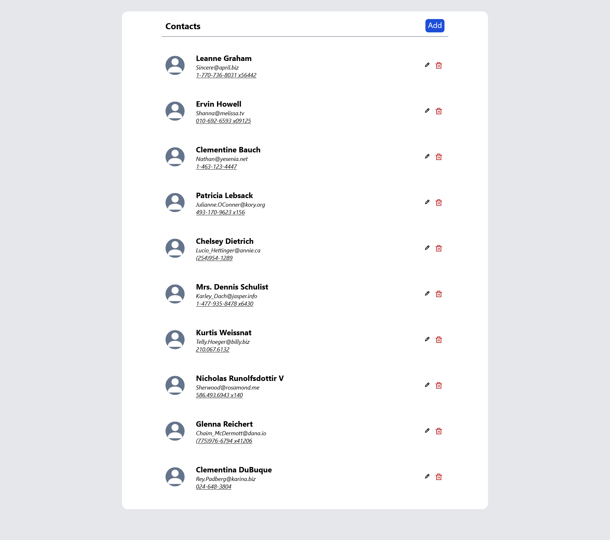

# Mira Payments - Fake API Crud Functionality (Task Solution)

## Table of contents

- [Overview](#overview)
  - [The challenge](#the-challenge)
  - [Screenshot](#screenshot)
  - [Links](#links)
- [My process](#my-process)
  - [Built with](#built-with)
  - [What I learned](#what-i-learned)
  - [Useful resources](#useful-resources)
- [Author](#author)

## Overview

### The challenge

Users should be able to:

- Perform CRUD operations
- See hover states for all interactive elements on the page
- Have basic form validations

### Screenshot



### Links

- Solution URL: [GitHub](https://github.com/drew-chidi/contacts_manager_crud)
- Live Site URL: [Netlify](https://contacts-manager-drew.netlify.app/)

## My process

### Built with

- Semantic HTML5 markup
- CSS custom properties
- Flexbox
- Mobile-first workflow
- [React-Router]
- [Formik]
- [React](https://reactjs.org/) - JS library
- [JSONPlaceholder API](https://jsonplaceholder.typicode.com/users) - API
- [Tailwind CSS](https://styled-components.com/) - For styles

### What I learned

When hosting a site made with React-Router on Netlify, a common bug is the 'page not found' page when trying to access a route via URL. To fix this, I created a file in the public folder named \_redirects and add /\* /index.html 200 to it.

```_redirect
/* /index.html 200
```

### Useful resources

- [How to Deploy a React Router-Based Application to Netlify](https://www.freecodecamp.org/news/how-to-deploy-react-router-based-app-to-netlify/) - This helped me solved the routing issue on deployment.

## Author

- Website - [Andrew](https://drew-portfolio.netlify.app/)
- Email - (chidi.andrew@gmail.com)
